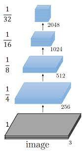
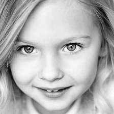

# Diagnosing-Autism-Spectrum-using-Neural-Network

## Introduction
Autism spectrum disorder (ASD) is a complex developmental condition that involves persistent challenges in social interaction, speech and nonverbal communication, and restricted/repetitive behaviors.
Diagnosing autism spectrum disorder (ASD) can be difficult because there is no medical test, like a blood test, to diagnose the disorder. Doctors look at the child's developmental history and behavior to make a diagnosis.
In recent years the number of publications applying computer vision techniques to static medical imagery has grown from hundreds to thousands. A few areas have received substantial attention—radiology, pathology, ophthalmology, and dermatology—owing to the visual pattern-recognition nature of diagnostic tasks in these specialities, and the growing availability of highly structured images.
This project aims to diagnose autism spectrum disorder based on the child face image using Computer Vision techniques.

## Background
MU Researchers Identify Differences in Facial Characteristics of Children with Autism Compared to Typically Developing Children, found :
* Children with autism have a broader upper face, including wider eyes.
* Children with autism have a shorter middle region of the face, including the cheeks and nose.
* Children with autism have a broader or wider mouth and philtrum – the divot below the nose, above the top lip.

## Dataset
The dataset contains subfolders for the train category (autistic children and non-autistic children). There are 2,536 children faces training images, 1,268 autistic children faces and 1,268 non-autistic children faces. The testing set contains 400 images for children and you have to classify each of them.

  |  

## Architectures
### 5 Downscales then 9 residual blocks then FCL’5D9R’
The first architecture starts with 5 Conv Blocks, each one consisting of   Conv2d(stride=2), norm layer and RelU. and then 9 residual blocks consist of Conv2d, norm layer and RelU and then its ends with fully connected layers.
	
### 5 Downscales then 6 residual blocks then FCL’5D6R’
Second architecture starts with 5 Conv Blocks, each one consisting of Conv2d(stride=2), norm layer and RelU. and then 6 residual blocks consist of Conv2d, norm layer and RelU, so it's shorter than the first archticture and then its ends with fully connected layers.

### Encoder Arch consists of Strides and residual blocks then FCL’Enc’
Third architecture consists of downscales bloks and residual blocks too, but mixed to not lose information in the first downscale blocks. 

  |  

### Inceptionv3
Last architecture was built based on the famous architecture InceptionV3, and followed by fully connected layers.

## Best Model
Best model that achieved 99% accuracy on the validation dataset is Inceptionv3, and there is number of reasons for that, The idea behind the Inception layer that deploy multiple convolutions with multiple filters and pooling layers simultaneously in parallel within the same layer, one of the advantage of using InceptionV3 is that its trained the Image net dataset that more than contain 14 million images.

## Preprocessing
For preprocessing the target was to show the facial information more, to help the model to analyze the face more.
* Face localization, to focus in the face only.

  |  

* Facial information detection, to help the model to find interest points.

  |  

* Augmentation, to increase the training dataset, by flipping the image and rotating the original and the flipped image  45° positive and negative, to end up having 5 new images for each image.

  |    |    |    |    |  

* RGB to Gray.

  |  

## Conclusion
Our model achieved 91.87% accuracy on the testset, and this can be encouragement to us and the Deep Learning community to invest more in the medical field.
For a problem with less amount of data recommended to fine tuning  pretrained model like IncptiInceptionV3, VGG, ResNet … etc. If you can't find a pretrained model that trained on data similar to your dataset, you should try to simplify the problem and give the model more information that help to get the target output, like in our problem facial features and face localization.
